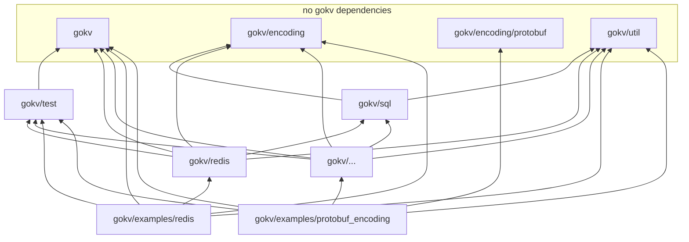

Releasing
=========

History
-------

Before `v0.6.0` there were no Go modules, and a version tag / release applied to the entire `gokv` repository.

With `v0.6.0` we split the repo into many separate Go modules, so that importing for example `redis` didn't also bring in the dependencies of `mongodb` (even if just listed as transitive dependency).

But the release process for `v0.6.0` was not ideal: The root `gokv` module, the helper modules (`gokv/encoding`, `gokv/sql`, `gokv/test` and `gokv/util`) and all store implementations (`redis` etc.) were all tagged on the same commit. But this lead to `redis@v0.6.0` for example referencing `gokv@v0.5.1` instead of `gokv@v0.6.0`. For that root module with just the interface it didn't matter much, but for the others a bit more.

Alternatives
------------

Moving forward, we have different options:

1. Same as `v0.6.0`: Tag all packages on the same commit.
   - Pros: It's nice that all tags point to the same commit, and we can create a GitHub release for the root `gokv/v0.7.0` tag, describing all the changes
   - Cons: The store implementations' `go.mod` files would point to `gokv` package `v0.6.0`, while it would be nicer to have them point to `v0.7.0`
2. Like 1., but before the tag, update the store implementations to use `gokv`/`gokv/encoding`/etc.'s master version
   - Pros: Up-to-date version of `gokv`/`gokv/encoding`/... dependency instead of `v0.6.0`
   - Cons: For people working on a project that doesn't have a direct dependency on `gokv` root module, but only on a store implementation, they end up with a `gokv` transitive dependency with that "dirty" master version instead of a clean tag
3. Tag `gokv` root module and `gokv/encoding`, etc. first. Then add commits that update the dependencies in the store implementations so they point to those helper `v0.7.0` versions, then add the `redis/v0.7.0` etc tags.
   - Pros: When someone just imports `gokv/redis@v0.7.0`, they'll have a nice transitive dependency on `gokv@v0.7.0`
   - Cons: On which tag should the GitHub release go? It can't be the plain `v0.7.0` because at that commit the stores don't have the `v0.7.0` tag yet. Or technically it could be, because module versions are independent from GitHub Releases, but it might be confusing and isn't nice/clean.
4. Tag all modules completely separately and instead of doing a single GitHub release and CHANGELOG, have one for each separate module
   - Pros: This fits the Go module versioning where each module requires its own tag (e.g. `redis/v0.7.0`). Most users might only care about a specific store implementation and its changelog so it's cleaner for them to only see that and not others.
   - Cons: Might be a mess with dozens of GitHub releases. Also, for stores where there was no change, should it stay at `v0.6.0`? Could it become a mess to have various different versions across the repo?

(As discussed [here](https://github.com/philippgille/gokv/discussions/159#discussioncomment-7864394) already)

Choice
------

For `v0.7.0` there were a lot of changes across the whole repository, and changes for *all* modules, like using `any` instead of `interface{}`. So we won't go with option 4 yet, also because option 5 makes it harder to go back to one of the other options, as modules would likely have different versions already.

Of the other options, 3 is the cleanest, so we go with that.

Details
-------

Here's a diagram of the `gokv` internal dependencies:

So we tag the top row first, then update the second row, then tag the second row, etc.

For the GitHub release, we can create a tag `release/v0.7.0` when all Go modules are updated and tagged. That way anyone landing on the release page and clicking on the commit to view the repo, would see all modules in their `v0.7.0` version. It's a bit unconventional for software releases on GitHub, but then again the Go module versioning requires a bit of an unconventional process anyway - with each module requiring their own tag, implying that there's not a single central tag that can be used for a central release that spans multiple modules with dependencies between them.
